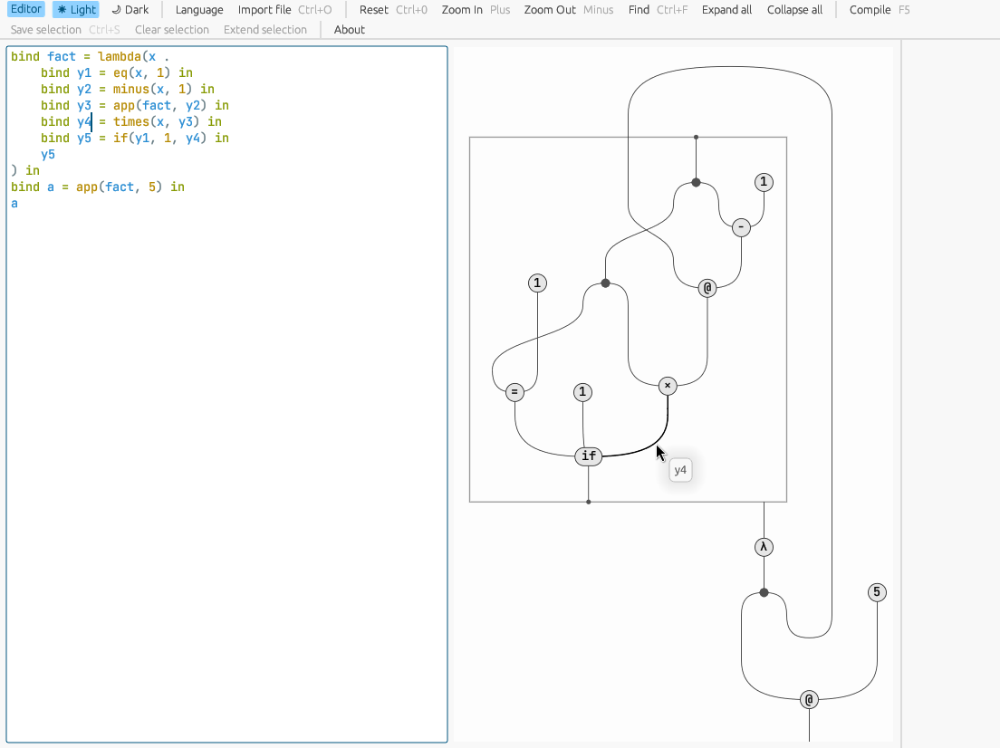
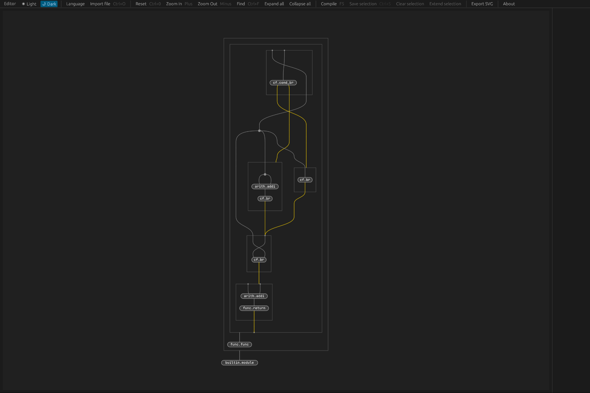

# sd-visualiser
String diagram visualiser for programs with semantics in closed monoidal categories.

## Visualising string diagrams

sd-visualiser is an interactive tool to visualise string diagrams, based on idea that string diagrams encoded as hierarchical hypergraphs, representing terms in a closed monoidal category, provide a foundation for building programming languages, building on the work of [1] [2].

A toy language, `sd` language, is defined in a similar vein to the `spartan` language [3], and is used to define programs which can be represented as string diagrams.
sd-visualiser provides a playground to experiment with the `sd` language, and to visualise and interact with the corresponding string diagram.

sd-visualiser also supports LLVM MLIR [4], and can be used to visualise MLIR programs as string diagrams.

### Screenshots


*sd-visualiser running in the web browser at <https://sd-visualiser.github.io/sd-visualiser/>*


*MLIR simple example*

## Using the precompiled binaries

### Web

Please go to <https://sd-visualiser.github.io/sd-visualiser/> to use the web version of the visualiser.
Minor features such as SVG export and fast layout are not available in the web version.

### Linux (Ubuntu)

```bash
sudo apt install coinor-libcbc3 libgtk-3-dev
```

## References

[1] D. R. Ghica, K. Muroya, and T. W. Ambridge, ‘A robust graph-based approach to observational equivalence’. arXiv, Sep. 23, 2021. doi: 10.48550/arXiv.1907.01257.

[2] D. Ghica and F. Zanasi, ‘String Diagrams for $\lambda$-calculi and Functional Computation’. arXiv, Oct. 19, 2023. doi: 10.48550/arXiv.2305.18945.

[3] T. W. Ambridge, ‘Sᴘᴀʀᴛᴀɴ Visualiser’, Spartan Visualiser. https://tnttodda.github.io/Spartan-Visualiser/.

[4] C. Lattner et al., ‘MLIR: Scaling Compiler Infrastructure for Domain Specific Computation’, in 2021 IEEE/ACM International Symposium on Code Generation and Optimization (CGO), Feb. 2021, pp. 2–14. doi: 10.1109/CGO51591.2021.9370308.


[1]: https://arxiv.org/abs/1907.01257
[2]: https://arxiv.org/abs/2305.18945
[3]: https://tnttodda.github.io/Spartan-Visualiser/
[4]: https://mlir.llvm.org/

